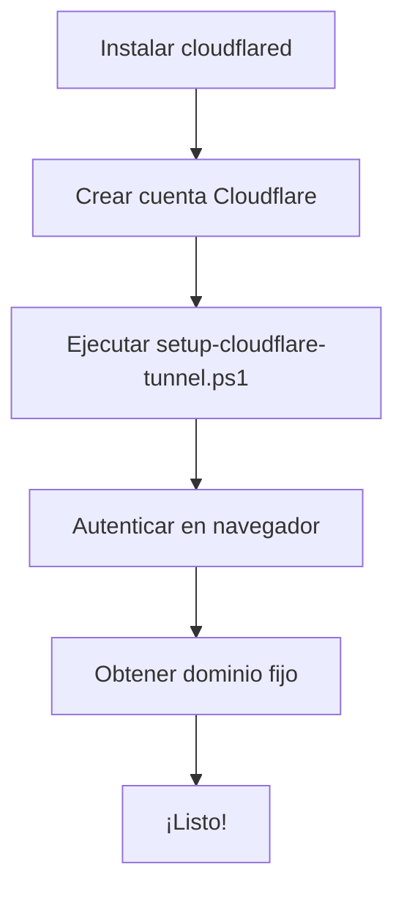
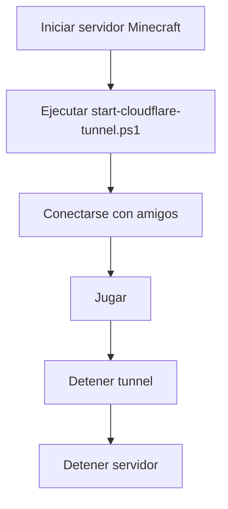

# Cloudflare Tunnel - Guía Completa

**Versión:** 1.0.0  
**Fecha:** 2025-10-25  
**Proyecto:** DockerCraft

---

## 📋 Tabla de Contenidos

- [¿Qué es Cloudflare Tunnel?](#qué-es-cloudflare-tunnel)
- [Dos Formas de Usar Cloudflare Tunnel](#dos-formas-de-usar-cloudflare-tunnel)
- [Quick Tunnel (Sin Cuenta)](#quick-tunnel-sin-cuenta)
- [Tunnel Persistente (Con Cuenta)](#tunnel-persistente-con-cuenta)
- [Ventajas vs Port Forwarding](#ventajas-vs-port-forwarding)
- [Instalación](#instalación)
- [Uso Diario](#uso-diario)
- [Troubleshooting](#troubleshooting)
- [FAQ](#faq)

---

## 🌐 ¿Qué es Cloudflare Tunnel?

Cloudflare Tunnel (anteriormente Argo Tunnel) es un servicio **100% GRATUITO** que permite exponer tu servidor de Minecraft a internet sin necesidad de:

- ❌ Configurar port forwarding en tu router
- ❌ Exponer tu IP pública directamente
- ❌ Lidiar con IPs dinámicas
- ❌ **Comprar o tener un dominio propio**

**✅ Cloudflare te asigna un dominio automáticamente - GRATIS**

---

## 🎯 Dos Formas de Usar Cloudflare Tunnel

Cloudflare ofrece **DOS opciones gratuitas** según tus necesidades:

### 🚀 Opción 1: Quick Tunnel (Recomendado para Empezar)

**Características:**
- ✅ **100% Gratis**
- ✅ **Sin necesidad de cuenta**
- ✅ **Setup en 30 segundos**
- ✅ **Cloudflare te asigna un dominio automáticamente**
- ⚠️ El dominio cambia cada vez que reinicias

**Ideal para:**
- Probar el servidor con amigos
- Sesiones de juego temporales
- Testing rápido

**Ejemplo de dominio asignado:**
```
random-words-123.trycloudflare.com
```

---

### 🔒 Opción 2: Tunnel Persistente (Dominio Permanente)

**Características:**
- ✅ **100% Gratis**
- ✅ Requiere cuenta gratuita de Cloudflare
- ✅ **Dominio fijo que NUNCA cambia**
- ✅ Setup en 5 minutos
- ✅ Configuración persistente

**Ideal para:**
- Servidor permanente
- Compartir con comunidad
- No cambiar la IP cada vez

**Ejemplo de dominio asignado:**
```
abc12345-6789-def0.cfargotunnel.com
```

---

## ⚡ Quick Tunnel (Sin Cuenta)

### Instalación

```powershell
# Instalar cloudflared (solo una vez)
.\scripts\tunnel\install-cloudflared.ps1
```

### Uso

```powershell
# Iniciar servidor de Minecraft
docker compose up -d

# Iniciar Quick Tunnel
.\scripts\tunnel\quick-tunnel.ps1
```

**Resultado:**

```
======================================
  Cloudflare Quick Tunnel (GRATIS)
======================================

Características:
  - Dominio temporal GRATIS
  - NO necesitas cuenta
  - NO necesitas dominio propio
  - Cloudflare te asigna uno automáticamente

Iniciando tunnel...
----------------------------------------------------

Your quick Tunnel has been created!
Visit it at: https://amazing-server-123.trycloudflare.com
----------------------------------------------------
```

### Conectarse desde Minecraft

1. Abre Minecraft
2. Multiplayer → Direct Connect
3. Pega el dominio: `amazing-server-123.trycloudflare.com`
4. **No agregues puerto** - Cloudflare lo maneja automáticamente
5. ¡Conecta!

### Detener el Tunnel

Presiona `Ctrl+C` en la ventana del tunnel, o ejecuta:

```powershell
.\scripts\tunnel\stop-cloudflare-tunnel.ps1
```

---

## 🔒 Tunnel Persistente (Con Cuenta)

### Requisitos

- ✅ Windows 10/11 (o Linux/macOS)
- ✅ Cuenta gratuita de Cloudflare (sin tarjeta de crédito)
- ✅ Conexión a internet estable
- ✅ Servidor de Minecraft corriendo en localhost:25565

**Nota:** NO necesitas tener un dominio propio. Cloudflare te asigna uno automáticamente.

### Crear Cuenta de Cloudflare (2 minutos)

1. Visita: https://dash.cloudflare.com/sign-up
2. Registra una cuenta **GRATIS**
3. Verifica tu email
4. ¡Listo! No necesitas configurar nada más

**Importante:** No te piden tarjeta de crédito ni información de pago.

---

## 🚀 Instalación

### Instalar cloudflared (Solo Una Vez)

Ejecuta el script de instalación:

```powershell
.\scripts\tunnel\install-cloudflared.ps1
```

Esto hará:
- Descargar `cloudflared.exe` desde el repositorio oficial
- Instalarlo en `C:\cloudflared\`
- Verificar la instalación

**Verificar instalación:**

```powershell
C:\cloudflared\cloudflared.exe --version
```

Deberías ver algo como:
```
cloudflared version 2025.10.0 (built 2025-10-14T16:16 UTC)
```

---

## ⚙️ Setup del Tunnel Persistente

### Paso 1: Autenticación

Ejecuta el script de configuración:

```powershell
.\scripts\tunnel\setup-cloudflare-tunnel.ps1
```

### ¿Qué hace este script?

1. **Autenticación:**
   - Abre tu navegador automáticamente
   - Te pide iniciar sesión en Cloudflare (o crear cuenta gratuita)
   - Te pide autorizar la aplicación
   - Guarda las credenciales localmente

2. **Creación del Tunnel:**
   - Crea un tunnel con nombre `dockercraft-minecraft`
   - Obtiene un ID único (UUID)
   - **Cloudflare te asigna un dominio fijo GRATIS:** `<UUID>.cfargotunnel.com`

3. **Configuración:**
   - Crea el archivo `C:\cloudflared\config.yml`
   - Configura el enrutamiento a `localhost:25565`
   - Guarda las credenciales

### Resultado

Al finalizar, verás:

```
======================================
  ✅ Setup completado!
======================================

Tu dominio de Cloudflare (PERMANENTE Y GRATIS):
   abc123-456-def.cfargotunnel.com

Para iniciar el tunnel:
   .\scripts\tunnel\start-cloudflare-tunnel.ps1
```

**¡Guarda este dominio!** Es tu dirección **permanente** para conectarte. Nunca cambia.

---

## 🎮 Uso Diario

### Opción A: Quick Tunnel (Temporal)

**Para sesiones rápidas:**

```powershell
# Iniciar servidor
docker compose up -d

# Iniciar Quick Tunnel
.\scripts\tunnel\quick-tunnel.ps1
```

**Salida esperada:**

```
======================================
  Cloudflare Quick Tunnel (GRATIS)
======================================

Características:
  - Dominio temporal GRATIS
  - NO necesitas cuenta
  - NO necesitas dominio propio

Iniciando tunnel...
----------------------------------------------------

Your quick Tunnel has been created!
Visit it at: https://cool-game-789.trycloudflare.com
----------------------------------------------------
```

**Copia el dominio y compártelo con tus amigos.**

---

### Opción B: Tunnel Persistente

**Para servidor permanente:**

```powershell
# Iniciar servidor
docker compose up -d

# Iniciar tunnel persistente
.\scripts\tunnel\start-cloudflare-tunnel.ps1
```

**Salida esperada:**

```
======================================
  Iniciando Cloudflare Tunnel
======================================

✅ Verificando servidor de Minecraft... OK
✅ Iniciando tunnel...

Tunnel activo!
Dominio: abc123-456-def.cfargotunnel.com
Presiona Ctrl+C para detener
```

**Mantén esta ventana abierta mientras juegas.**

---

### Detener el Tunnel

Cuando termines de jugar:

**Opción 1:** Presiona `Ctrl+C` en la ventana del tunnel

**Opción 2:** Ejecuta:

```powershell
.\scripts\stop-cloudflare-tunnel.ps1
```

---

### Conectarse al Servidor

**En Minecraft:**

1. Abre Minecraft
2. Multiplayer → Direct Connect
3. Ingresa tu dominio: `abc123-456-def.cfargotunnel.com`
4. ¡Conecta!

**Compartir con amigos:**

Comparte SOLO el dominio de Cloudflare:
```
Servidor: abc123-456-def.cfargotunnel.com
Versión: 1.21.1 (Paper)
```

**NO compartas tu IP pública.** Cloudflare la mantiene oculta.

---

## 🔄 Flujo Completo

### Primer Uso (Setup)



### Uso Diario



---

## 🐛 Troubleshooting

### Error: "cloudflared no instalado"

**Causa:** El script no encuentra `C:\cloudflared\cloudflared.exe`

**Solución:**

```powershell
.\scripts\install-cloudflared.ps1
```

---

### Error: "No se pudo autenticar"

**Causa:** No completaste la autorización en el navegador

**Solución:**

1. Ejecuta nuevamente:
   ```powershell
   .\scripts\setup-cloudflare-tunnel.ps1
   ```

2. Cuando se abra el navegador, **autoriza la aplicación**
3. Presiona Enter en la consola cuando termine

---

### Error: "Tunnel ya existe"

**Causa:** Ya creaste un tunnel previamente

**Solución:**

Listar tunnels existentes:

```powershell
C:\cloudflared\cloudflared.exe tunnel list
```

Si quieres usar uno existente, edita `C:\cloudflared\config.yml` con el ID correcto.

Si quieres eliminarlo y crear uno nuevo:

```powershell
C:\cloudflared\cloudflared.exe tunnel delete dockercraft-minecraft
```

Luego ejecuta el setup nuevamente.

---

### Error: "No hay servidor de Minecraft corriendo"

**Causa:** El contenedor de Docker no está activo

**Solución:**

```powershell
docker compose up -d
```

Espera 30 segundos y vuelve a iniciar el tunnel.

---

### No puedo conectarme desde Minecraft

**Verificar:**

1. **¿El tunnel está activo?**
   ```powershell
   Get-Process cloudflared
   ```

2. **¿El servidor está corriendo?**
   ```powershell
   docker ps
   ```

3. **¿El dominio es correcto?**
   Verifica en la salida de `start-cloudflare-tunnel.ps1`

4. **¿La versión de Minecraft coincide?**
   El servidor usa Paper 1.21.1

**Testing de conectividad:**

```powershell
Test-NetConnection -ComputerName abc123-456-def.cfargotunnel.com -Port 25565
```

Si falla, revisa:
- Firewall local (permitir cloudflared)
- Antivirus
- VPN (desconectar temporalmente)

---

### Tunnel se desconecta constantemente

**Causas posibles:**

1. **Conexión inestable:**
   - Verifica tu internet
   - Prueba con cable en lugar de WiFi

2. **Recursos insuficientes:**
   - Cierra programas pesados
   - Aumenta RAM del servidor

3. **Reinicio automático de Windows:**
   - Desactiva actualizaciones durante el juego

**Logs del tunnel:**

```powershell
C:\cloudflared\cloudflared.exe tunnel --config C:\cloudflared\config.yml run --loglevel debug
```

---

## ❓ FAQ

### ¿Cloudflare Tunnel es realmente gratis?

**SÍ**, 100% gratis sin límites de tráfico para uso personal. Cloudflare no te cobra nada.

**Opciones gratuitas:**
1. **Quick Tunnel:** Sin cuenta, dominio temporal
2. **Tunnel Persistente:** Con cuenta gratuita, dominio fijo

Ambas opciones son completamente gratuitas.

---

### ¿Necesito tener un dominio propio?

**NO.** Cloudflare te asigna un dominio automáticamente y GRATIS.

**Dominios asignados por Cloudflare:**
- **Quick Tunnel:** `random-words-123.trycloudflare.com`
- **Tunnel Persistente:** `abc-123-def.cfargotunnel.com`

No necesitas comprar ni tener ningún dominio propio.

---

### ¿El dominio cambia cada vez?

Depende de la opción que uses:

**Quick Tunnel (sin cuenta):**
- ❌ El dominio **SÍ cambia** cada vez que reinicias
- Ejemplo: `random-123.trycloudflare.com` → `different-456.trycloudflare.com`

**Tunnel Persistente (con cuenta gratuita):**
- ✅ El dominio **NO cambia NUNCA**
- Ejemplo: `abc-123-def.cfargotunnel.com` (permanente)

**Recomendación:** 
- Para probar rápido: Quick Tunnel
- Para servidor permanente: Tunnel Persistente

---

### ¿Puedo usar mi propio dominio?

Sí, si tienes un dominio en Cloudflare. Requiere configuración adicional:

```yaml
ingress:
  - hostname: minecraft.midominio.com
    service: tcp://localhost:25565
```

Luego agregar un DNS record en Cloudflare apuntando a tu tunnel.

---

### ¿Afecta la latencia?

Ligeramente. Cloudflare añade ~10-30ms de latencia adicional.

**Comparación:**
- Port forwarding directo: 50ms
- Cloudflare Tunnel: 60-80ms

Para jugar casual, es imperceptible.

---

### ¿Puedo correr múltiples servidores?

Sí. Edita `C:\cloudflared\config.yml`:

```yaml
tunnel: <tu-tunnel-id>
credentials-file: C:\Users\TuUsuario\.cloudflared\<tu-tunnel-id>.json

ingress:
  - hostname: survival.cfargotunnel.com
    service: tcp://localhost:25565
  - hostname: creative.cfargotunnel.com
    service: tcp://localhost:25566
  - service: http_status:404
```

Requiere configurar DNS records en Cloudflare.

---

### ¿Es más seguro que port forwarding?

Sí. Ventajas de seguridad:

- ✅ Tu IP real está oculta
- ✅ DDoS protection de Cloudflare
- ✅ No expones puertos en tu router
- ✅ Tráfico encriptado
- ✅ No necesitas DMZ

---

### ¿Puedo ver métricas del tunnel?

Sí, en el dashboard de Cloudflare:

1. https://dash.cloudflare.com/
2. Zero Trust → Access → Tunnels
3. Selecciona tu tunnel

Verás:
- Tráfico (bandwidth)
- Conexiones activas
- Uptime
- Errores

---

### ¿Qué pasa si mi PC se apaga?

El servidor se detiene. Cloudflare Tunnel requiere que:

1. Tu PC esté encendida
2. El servidor de Minecraft esté corriendo
3. El tunnel esté activo

**Para servidor 24/7:**
Considera migrar a un VPS como DigitalOcean ($6/mes).

---

### ¿Puedo automatizar el inicio del tunnel?

Sí, crear una tarea programada de Windows:

1. Abre "Task Scheduler"
2. Create Task:
   - **Trigger:** At log on
   - **Action:** Start a program
     - Program: `C:\cloudflared\cloudflared.exe`
     - Arguments: `tunnel --config C:\cloudflared\config.yml run`
   - **Settings:** Run whether user is logged on or not

**Importante:** Configura también el auto-inicio del servidor de Minecraft.

---

## 📚 Recursos Adicionales

### Documentación Oficial

- **Cloudflare Tunnel Docs:** https://developers.cloudflare.com/cloudflare-one/connections/connect-apps/
- **cloudflared GitHub:** https://github.com/cloudflare/cloudflared

### Scripts Relacionados

- [`scripts/tunnel/install-cloudflared.ps1`](../../scripts/tunnel/install-cloudflared.ps1) - Instalación
- [`scripts/tunnel/quick-tunnel.ps1`](../../scripts/tunnel/quick-tunnel.ps1) - **Quick Tunnel (sin cuenta)**
- [`scripts/tunnel/setup-cloudflare-tunnel.ps1`](../../scripts/tunnel/setup-cloudflare-tunnel.ps1) - Setup persistente
- [`scripts/tunnel/start-cloudflare-tunnel.ps1`](../../scripts/tunnel/start-cloudflare-tunnel.ps1) - Iniciar persistente
- [`scripts/tunnel/stop-cloudflare-tunnel.ps1`](../../scripts/tunnel/stop-cloudflare-tunnel.ps1) - Detener

### Documentación del Proyecto

- [`docs/PUBLIC_DEPLOYMENT_GUIDE.md`](PUBLIC_DEPLOYMENT_GUIDE.md) - Guía completa de deployment
- [`docs/PUBLIC_TROUBLESHOOTING.md`](PUBLIC_TROUBLESHOOTING.md) - Troubleshooting para jugadores
- [`docs/SECURITY.md`](SECURITY.md) - Guía de seguridad

---

## 🆘 Soporte

Si tienes problemas:

1. **Revisa Troubleshooting:** Ver sección anterior
2. **Revisa logs:**
   ```powershell
   docker compose logs
   ```
3. **Cloudflare Community:** https://community.cloudflare.com/
4. **GitHub Issues:** https://github.com/tu-usuario/dockercraft/issues

---

## 📝 Changelog

### v1.0.0 (2025-10-25)

- ✅ Documentación inicial
- ✅ Scripts de instalación y setup
- ✅ Guía de troubleshooting
- ✅ FAQ completo

---

**Última actualización:** 2025-10-25  
**Mantenedor:** @gastonfr24  
**Licencia:** MIT

